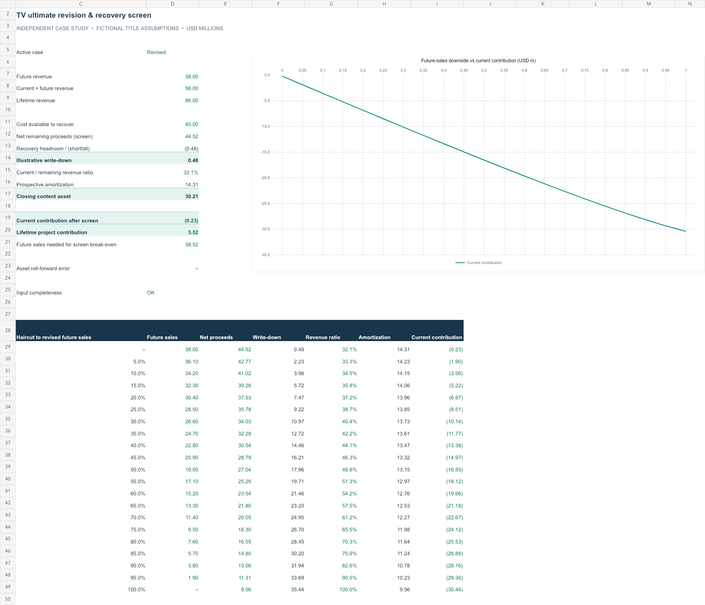

# SeriesWorth | TV Lifetime Profitability

**Independent entertainment FP&A case study · Excel + Python**

An editable lifetime title model that connects a revised sales outlook to **current contribution, prospective cost amortization, and a recoverability warning**.

The target FP&A role explicitly works with television ultimates. Sony's public accounting disclosures also explain why lifetime revenue estimates matter to film-cost measurement. This project models that analytical responsibility without claiming that Sony has a particular unreported impairment problem. [Sources and scope](SOURCES.md)

> Signal House is fictional. Every title-level input and modeled outcome is simulated. The recovery screen is educational and does not establish an IFRS impairment charge or Sony's actual accounting treatment.

## Review in 90 seconds

1. Read the [management memo](EXECUTIVE_MEMO.md).
2. Download the [Excel model](financial-model.xlsx?raw=true). On **Inputs**, change D5: 1 = prior, 2 = revised, 3 = downside, 4 = stress.
3. Review the [calculation engine](model.py), [scenario outputs](results/metrics.json), and [sensitivity sweep](results/sensitivity.csv).



## Result from the fictional title

| Metric, USD millions | Prior | Revised | 25% downside to revised future sales |
|---|---:|---:|---:|
| Future revenue | 52.00 | 38.00 | 28.50 |
| Lifetime revenue, including historical/current | 100.00 | 86.00 | 76.50 |
| Illustrative recovery-screen write-down | — | 0.48 | 9.22 |
| Prospective amortization | 11.57 | 14.31 | 13.85 |
| Current contribution after screen | 2.99 | (0.23) | (8.51) |
| Lifetime project contribution | 18.40 | 5.52 | (3.22) |

The title can still show a positive lifetime contribution while the remaining carrying cost fails the simplified recovery screen. Historical earnings do not make the current carrying amount recoverable. The model makes that distinction visible.

## Skills demonstrated

- Build and revise a title ultimate by domestic, international and catalog windows.
- Separate historical actuals, current-period results and remaining revenue assumptions.
- Apply a prospective current/remaining revenue ratio to the remaining cost basis.
- Explain the difference between lifetime profitability, period profit and carrying-value recovery.
- Present a sensitivity, review trigger and control evidence for Accounting / FP&A collaboration.

These are relevant demonstrations for JR114637, not an assertion that Sony requires this specific project.

## Run locally

Python 3.10+; standard library only.

```sh
python3 model.py
python3 -m unittest -v
```

The model regenerates JSON results for four cases and a 0–100% haircut sensitivity in 5-point increments. Seven tests cover the roll-forward, no-revenue boundary, break-even threshold, duplicate windows and preservation of historical inputs. [Calculation definitions](MODEL_GUIDE.md)

The Excel file calculates separately from the same starting assumptions. Editing the JSON and running Python does not update Excel or the written memo. The workbook has been recalculated, reconciled to Python, checked with scenario/window edits and visually reviewed; native Microsoft Excel execution was not tested.
